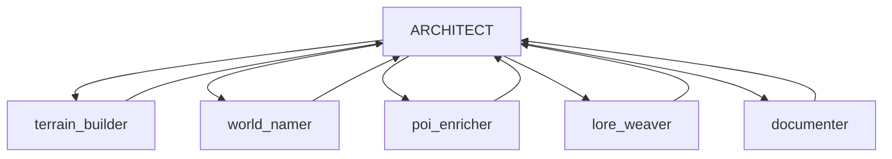

# SPECTRE World Generation System

**Procedural World Generator with MCP Control and Live Web Visualization**

---

## 🌍 Overview

SPECTRE is an advanced procedural world generation system that combines:
- **MCP Protocol Server** for external control (Kilo Code compatible)
- **3D Web Visualization** with live updates via WebSocket
- **Procedural Terrain Generation** with biome classification
- **Dynamic World Building** with named regions and points of interest
- **Lore Generation** for rich world history and mythology

---

## 🚀 Quick Start

### Prerequisites
- Python 3.8+
- Node.js 14+
- Modern web browser

### Installation
```bash
# Install Python dependencies
pip install -r requirements.txt

# Install Node dependencies
npm install

# Start the server
python server/main.py

# Open web interface
npm start
```

---

## 🏗️ Architecture

```
┌─────────────────────────────────────────────────────────────────────────────┐
│                           SPECTRE SYSTEM                                     │
├─────────────────────────────────────────────────────────────────────────────┤
│                                                                              │
│  ┌──────────────────┐         ┌──────────────────┐         ┌─────────────┐ │
│  │   KILO CODE      │         │   MCP SERVER     │         │  WEB UI     │ │
│  │   (Spectre)      │◄───────►│   (Standalone)   │◄───────►│  (Live)     │ │
│  │                  │  MCP    │                  │  WS/HTTP │             │ │
│  │  - Orchestrator  │  Proto  │  - World Engine  │         │  - 3D View  │ │
│  │  - World Builder │         │  - SQLite DB     │         │  - Events   │ │
│  │  - Documenter    │         │  - API Endpoints │         │  - Controls │ │
│  └──────────────────┘         │  - WebSocket Hub │         └─────────────┘ │
│          │                    └──────────────────┘                          │
│          │                             │                                    │
│          │                             ▼                                    │
│          │                    ┌──────────────────┐                         │
│          │                    │   BUILD DIARY    │                         │
│          └───────────────────►│   (Markdown)     │                         │
│                               │                  │                         │
│                               │  - Decisions     │                         │
│                               │  - Reflections   │                         │
│                               │  - Progress      │                         │
│                               └──────────────────┘                         │
│                                                                              │
└─────────────────────────────────────────────────────────────────────────────┘
```

---

## 📁 Project Structure

```
spectre-world-gen/
├── BUILD_DIARY.md              # Living documentation
├── README.md                   # This file
├── requirements.txt            # Python dependencies
├── package.json                # Node dependencies
│
├── server/                     # MCP Server + API
│   ├── main.py                 # FastAPI entry point
│   ├── mcp_handler.py          # MCP protocol handler
│   ├── world_engine.py         # Procedural generation
│   ├── database.py             # SQLite persistence
│   ├── events.py               # WebSocket broadcasting
│   └── api.py                  # REST endpoints
│
├── terrain/                    # Terrain generation
│   ├── noise.py                # Perlin noise
│   ├── biomes.py               # Biome classification
│   └── mesh.py                 # 3D mesh generation
│
├── web/                        # Live visualization
│   ├── index.html              # Main page
│   ├── app.js                  # Three.js visualization
│   ├── events.js               # WebSocket handler
│   └── style.css               # Styling
│
└── tools/                      # MCP tool definitions
    ├── world_tools.py          # World CRUD operations
    ├── region_tools.py         # Region naming/describing
    ├── poi_tools.py            # POI management
    └── lore_tools.py           # Lore generation
```

---

## 🎯 Features

### Core Capabilities
- **Procedural Terrain**: Multi-octave Perlin noise with 12 biome types
- **World Generation**: Configurable world sizes and parameters
- **Region Management**: Evocative naming and rich descriptions
- **POI System**: Detailed points of interest with NPCs and lore
- **Lore Engine**: Myth creation, historical events, and world history

### Technical Features
- **MCP Protocol**: Stdio-based communication for Kilo Code
- **REST API**: HTTP endpoints for web UI control
- **WebSocket**: Real-time event broadcasting
- **SQLite DB**: Persistent world state storage
- **Three.js Visualization**: Interactive 3D world view

### Web Interface
- **Live Terrain View**: Color-coded biome visualization
- **POI Markers**: Interactive map points
- **Event Feed**: Real-time activity stream
- **Region Info**: Detailed selection panel

---

## 🔧 MCP Tools

### World Management
- `create_world`: Generate procedural terrain
- `get_world`: Retrieve world state
- `get_statistics`: Biome distribution, POI counts

### Region Tools
- `get_region`: Get tile details
- `name_region`: Assign evocative name
- `describe_region`: Generate rich description
- `batch_name_regions`: Name multiple regions

### POI Tools
- `list_pois`: List all points of interest
- `create_poi`: Add new POI
- `update_poi`: Modify POI
- `detail_poi`: Generate NPCs, rumors, secrets

### Lore Tools
- `generate_world_lore`: Myths and history
- `add_historical_event`: Timeline entries

---

## 🖥️ Web Visualization

### Event System
Every MCP action broadcasts WebSocket events:
```javascript
// Region named
{"type": "region_named", "x": 15, "y": 23, "name": "Whisperwood"}

// POI detailed
{"type": "poi_detailed", "id": "poi_123", "name": "The Sunken Temple"}

// Lore created
{"type": "lore_created", "type": "creation_myth"}
```

### Three.js Integration
- Dynamic terrain mesh generation
- Biome-based color mapping
- Interactive camera controls
- POI marker overlays

---

## 📚 Documentation

### Build Diary
The `BUILD_DIARY.md` contains:
- Architectural decisions
- Implementation progress
- Challenges and solutions
- Reflections and insights

### Development Log
Each session is documented with:
- Timestamps and phases
- Task breakdowns
- Sub-agent delegation
- Technical challenges
- Lessons learned

---

## 🤝 Contributing

### Boomerang Delegation Pattern


### Sub-Agent Modes
1. **terrain_builder**: Noise generation, biome classification
2. **world_namer**: Evocative region naming
3. **poi_enricher**: POI detailing with NPCs
4. **lore_weaver**: World history and mythology
5. **documenter**: Build diary maintenance

---

## 🏁 Getting Started with Development

1. **Start the server**:
   ```bash
   python server/main.py
   ```

2. **Run the web interface**:
   ```bash
   cd web && npm start
   ```

3. **Connect Kilo Code** via MCP protocol

4. **Monitor events** in the web UI feed

5. **Document everything** in BUILD_DIARY.md

---

## 🎓 Learning Resources

- [FastAPI Documentation](https://fastapi.tiangolo.com/)
- [Three.js Documentation](https://threejs.org/docs/)
- [MCP Protocol Specifications](https://mcp-protocol.specs)
- [Procedural Generation Techniques](https://pcg.wiki)

---

## 📜 License

MIT License - See [LICENSE.md](LICENSE.md) for details

---

## 🙏 Acknowledgments

- Inspired by procedural generation research
- Built with ❤️ by SPECTRE ARCHITECT
- Part of the Kilo Code ecosystem

---

**Build Status**: 🚧 Under Construction
**Version**: 0.1.0-alpha
**Last Updated**: 2025-12-02